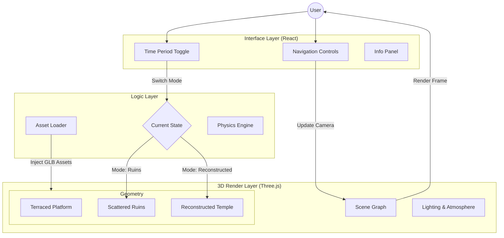

This is an exciting phase. Moving from theoretical reconstruction to a public-facing, interactive 3D web experience will democratize access to this archaeological mystery.

Since you have established the GitHub repository, I have designed the **architectural blueprint** for the software. We will not build a simple static viewer; we will build an immersive "digital twin" that allows users to toggle between the **ruined state** and the **reconstructed state**.

Here is the comprehensive development plan for your repository.

### 1\. The Tech Stack

For a project requiring high-fidelity rendering, physics (for the "weight" of the stones), and broad accessibility, I recommend the following modern stack. This ensures the application is lightweight but powerful.

| Component | Technology | Why? |
| :--- | :--- | :--- |
| **Framework** | **React 18+ (Vite)** | Fast development, modular component architecture. |
| **3D Engine** | **React Three Fiber (R3F)** | The industry standard for declarative 3D on the web. It manages Three.js complexity efficiently. |
| **Abstractions** | **Drei** | A helper library for R3F that provides ready-made camera controls, loaders, and environment maps. |
| **File Format** | **.GLB (Draco Compressed)** | Highly optimized binary JSON format. Crucial for loading 131-ton stone models quickly on mobile devices. |
| **Styling** | **Tailwind CSS** | For the UI overlay (menus, "info cards" when clicking stones). |

-----

### 2\. Repository Structure

Organize your GitHub repo with this specific file structure to separate the "Archaeological Data" from the "Application Logic."

```text
puma-punku-viz/
├── public/
│   ├── assets/
│   │   ├── models/           # GLB files (e.g., H-Block.glb, Gate_West.glb)
│   │   ├── textures/         # 2k textures for Red Sandstone and Andesite
│   │   └── data/
│   │       └── vranich_matrix.json  # Your measurement data & coordinates
├── src/
│   ├── components/
│   │   ├── World/
│   │   │   ├── Platform.jsx       # The terraced mound
│   │   │   ├── HBlockWall.jsx     # Procedural generation of the wall
│   │   │   └── GateComplex.jsx    # The detailed gateways
│   │   ├── UI/
│   │   │   ├── Overlay.jsx        # Instructions & History
│   │   │   └── ToggleSwitch.jsx   # "Ruins" vs "Reconstructed" toggle
│   │   └── Controls/
│   │       └── FirstPerson.jsx    # WASD + Mouse look controls
│   ├── lib/
│   │   └── stoneGenerator.js      # Logic to spawn blocks based on measurements
│   └── App.jsx
└── README.md
```

-----

### 3\. The Implementation Guide

Here is the step-by-step logic to populate the repository.

#### Phase A: The Asset Pipeline (Blender to Web)

We cannot just load raw scan data; it will crash the browser. We must create optimized "Game Ready" assets.

  * **Action:** Create a "Master" `.blend` file containing the archetypal stones (The H-Block, The Slab, The Gate Fragment).
  * **Optimization:** Use "Baking" to transfer the high-detail surface imperfections of the andesite onto a low-polygon model.
  * **Export:** Export these as `.glb` files using **Draco Compression** (reduces file size by \~90%).

#### Phase B: The React Three Fiber Scene

We will use a declarative approach. Instead of placing every stone manually, we will feed your measurement data into a component that *builds* the wall.

*Example Code Snippet for `HBlockWall.jsx`:*

```jsx
import { useGLTF, Instances, Instance } from '@react-three/drei'

export function HBlockWall({ data }) {
  // Load the optimized H-Block model once
  const { nodes, materials } = useGLTF('/assets/models/H-Block.glb')

  return (
    // 'Instances' allows us to render 100s of blocks with the cost of 1
    <Instances range={data.length} material={materials.Andesite} geometry={nodes.HBlock.geometry}>
      {data.map((block, i) => (
        <Instance 
            key={i} 
            position={[block.x, block.y, block.z]} 
            rotation={[0, block.rotation, 0]} 
        />
      ))}
    </Instances>
  )
}
```

#### Phase C: The "Infinity Gate" Effect

To visualize the "mirror effect" of the nested doors (Vranich's theory), we will use a specific lighting trick.

  * **Technique:** Place a `RectAreaLight` behind each successive doorframe in the digital model.
  * **User Interaction:** When the user stands at the specific "Processional Axis," trigger a subtle glow animation to highlight the alignment.

-----

### 4\. Software Architecture Diagram

This Mermaid diagram outlines how the user interaction flows through the application state to render the 3D scene.



### 5\. Deployment Strategy

Since this is a client-side visualization (no backend database required), we can deploy this cost-effectively.

1.  **Host:** Vercel or GitHub Pages.
2.  **CI/CD:** Connect the repo to Vercel. Every time you push a code update, the site automatically rebuilds.

### Next Step

I can draft the **`package.json` file** with the specific dependencies and versions you need to run `npm install` and get the empty 3D world running immediately. Would you like me to do that?
